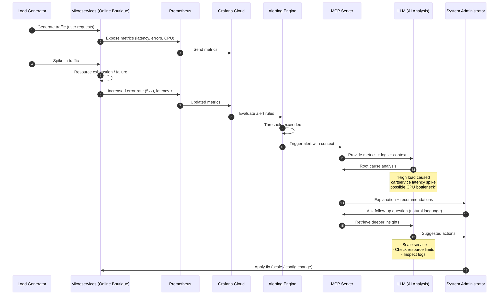

# Alert-G - Alerts organization with Grafana MCP support

## Authors
- Mateusz Król
- Iga Antonik
- Łukasz Wilański
- Jakub Kotara

## Table of Contents
1. [Introduction](#introduction)
2. [Theoretical background/ technology stack](#theoretical-background)
3. [Case study concept description](#case-study-concept)
    1. [Application](#application)
    2. [Observability](#observability)
    3. [Vizualization](#vizualization)
    4. [AI Integration](#ai-integration)
4. [Case study high level architecture](#case-study-high-level-architecture)
5. [Case study detailed architecture](#case-study-detailed-architecture)
6. [Environment setup & Installation](#installation)
7. [Demo deployment steps](#demo-deployment)
    1. [Configuration set-up](#configuration-setup)
    2. [Data preparation](#data-preparation)
8. [Demo description](#demo-description)
    1. [Execution procedure](#execution-procedure)
    2. [Results presentation](#results-presentation)
9. [Summary - conclusions](#summary-conclusions)
10. [References](#references)


## 1. Introduction <a name="introduction"></a>
Modern information systems, built on microservices architectures and orchestrated by the Kubernetes platform, generate an unprecedented volume of diagnostic data. In an era of dynamic scaling and Continuous Deployment (CI/CD), traditional monitoring approaches based on static dashboards are becoming insufficient. The primary challenge is no longer the collection of data itself, but rather its correlation and rapid interpretation during critical incidents.

There is a vital need to reduce the Mean Time To Recovery (MTTR), especially in distributed environments where a single component failure can trigger a domino effect across the entire cluster. To date, diagnostic tools have required administrators to be proficient in specialized query languages (such as PromQL for Prometheus) and to manually trace complex dependencies between services.

This project presents a modern approach to Observability, where the monitoring process is enhanced by Large Language Models (LLM). By leveraging the Model Context Protocol (MCP), we create an interface that allows AI models to interact directly with real-time operational data. The goal of this project is to demonstrate that integrating monitoring systems (Grafana Cloud) with intelligent agents allows for the automated analysis of root causes and dynamic environment configuration using natural language. This transition shifts the role of the system administrator from a manual dashboard analyst to a high-level AI operator.

## 2. Theoretical background/ technology stack <a name="theoretical-background"></a>
Modern observability systems are built upon three fundamental pillars: **metrics, logs, and traces**. These components provide a comprehensive view of system behavior and enable efficient monitoring and troubleshooting.

Metrics are numerical representations of system performance over time, such as CPU usage, memory consumption, or request latency. Logs provide detailed event records generated by applications, while traces allow tracking of requests as they propagate through distributed systems.

### Monitoring and Observability
- **Grafana Cloud** – platform for visualization, monitoring, and alert management  
- **Prometheus** – time-series database used for collecting and querying metrics  
- **Grafana Alerting** – unified alerting system for defining and managing alerts  

### Containerization and Orchestration
- **Docker** – containerization of application components  
- **Kubernetes** – orchestration, scaling, and deployment management  

### AI and Automation
- **Large Language Models (LLM)** – intelligent analysis of system behavior  (GPT?)
- **Model Context Protocol (MCP)** – communication layer between AI and observability tools  

### Visualization
- **Grafana Dashboards** – real-time monitoring dashboards  
- **Alert panels and logs exploration tools**

The integration of these technologies enables not only passive monitoring but also **active, AI-assisted system management**, where alerts and anomalies can be automatically interpreted and acted upon.


## 3. Case study concept description <a name="case-study-concept"></a>
The goal of the case study is to demonstrate an intelligent alert management system enhanced with AI capabilities using Grafana MCP integration.

### 3.1 Application <a name="application"></a>
The system is based on the **Online Boutique**, a cloud-first microservices demo application. The application is a web-based e-commerce app where users can browse items, add them to the cart, and purchase them. 

It consists of:
| Service                                              | Language      | Description                                                                                                                       |
| ---------------------------------------------------- | ------------- | --------------------------------------------------------------------------------------------------------------------------------- |
| [frontend](/src/frontend)                           | Go            | Exposes an HTTP server to serve the website. Does not require signup/login and generates session IDs for all users automatically. |
| [cartservice](/src/cartservice)                     | C#            | Stores the items in the user's shopping cart in Redis and retrieves it.                                                           |
| [productcatalogservice](/src/productcatalogservice) | Go            | Provides the list of products from a JSON file and ability to search products and get individual products.                        |
| [currencyservice](/src/currencyservice)             | Node.js       | Converts one money amount to another currency. Uses real values fetched from European Central Bank. It's the highest QPS service. |
| [paymentservice](/src/paymentservice)               | Node.js       | Charges the given credit card info (mock) with the given amount and returns a transaction ID.                                     |
| [shippingservice](/src/shippingservice)             | Go            | Gives shipping cost estimates based on the shopping cart. Ships items to the given address (mock)                                 |
| [emailservice](/src/emailservice)                   | Python        | Sends users an order confirmation email (mock).                                                                                   |
| [checkoutservice](/src/checkoutservice)             | Go            | Retrieves user cart, prepares order and orchestrates the payment, shipping and the email notification.                            |
| [recommendationservice](/src/recommendationservice) | Python        | Recommends other products based on what's given in the cart.                                                                      |
| [adservice](/src/adservice)                         | Java          | Provides text ads based on given context words.                                                                                   |
| [loadgenerator](/src/loadgenerator)                 | Python/Locust | Continuously sends requests imitating realistic user shopping flows to the frontend.                                              |

### 3.2 Observability <a name="observability"></a>
Monitoring is implemented using Prometheus and Grafana Cloud. Metrics and logs are collected from all microservices and visualized through dashboards.

Grafana Alerting is configured to detect:
- increased response times  
- service unavailability  
- abnormal CPU and memory usage  
- error rate spikes (e.g., HTTP 5xx responses)  

### 3.3 Vizualization <a name="vizualization"></a>
Results are presented through:
- Grafana dashboards  
- alert panels  
- AI-generated summaries and explanations  


### 3.4 AI Integration <a name="ai-integration"></a>
The key innovation in this project is the integration of an LLM via the Model Context Protocol (MCP). In this architecture, the MCP server provides the LLM with resources collected by Grafana and Prometheus, such as alerts, metrics, logs, and other monitoring context. The AI model is capable of:
- interpreting alerts generated by Grafana  
- analyzing logs and metrics contextually  
- suggesting possible root causes  
- generating recommended actions in natural language 

This approach transforms traditional monitoring into an **interactive and intelligent observability system**.


## 4. Case study high level architecture <a name="case-study-high-level-architecture"></a>
The system architecture is divided into several logical layers:

**1. Data Generation Layer:**
- microservices-demo deployed in Kubernetes  
- simulated user traffic and system events  

**2. Data Collection Layer:**
- Prometheus collects metrics from services  
- logs are generated by application components  

**3. Observability Layer:**
- Grafana Cloud aggregates metrics and logs  
- dashboards visualize system state  
- Grafana Alerting evaluates alert rules  

**4. AI Integration Layer:**
- MCP server connects Grafana with the LLM  
- AI processes alerts and retrieves context data  
- natural language explanations are generated  

**5. User Interaction Layer:**
- system administrators interact via:
  - Grafana dashboards  
  - AI assistant interface  

**Architecture Flow:**
1. Application generates metrics and logs (OpenTelemetry)
2. Prometheus collects metrics  
3. Grafana visualizes and evaluates alert rules  
4. Alert is triggered  
5. MCP forwards context to LLM  
6. AI analyzes and returns explanation/recommendation  
7. User receives actionable insight  

This architecture enables **real-time, AI-supported decision-making**, significantly reducing the time required to diagnose and resolve issues.

Demo diagram:


## 5. Case study detailed architecture <a name="case-study-detailed-architecture"></a>
Compared to the high-level view, this section emphasizes implementation-oriented details and runtime interactions between system components.

### 5.1 Microservices Runtime Layer

The system is based on the **Online Boutique** microservices application deployed in a Kubernetes cluster. Each service runs as an independent container and is responsible for a specific business capability (e.g., cart management, payment processing, product catalog).

Key characteristics of this layer:
- Services communicate via HTTP and gRPC
- Each service exposes Prometheus-compatible metrics endpoints
- Stateless services are horizontally scalable within Kubernetes
- The `loadgenerator` component simulates realistic user traffic patterns to generate observable system behavior under load

This layer is the primary source of telemetry signals used in the observability pipeline.


### 5.2 Telemetry Collection and Metrics Pipeline

The telemetry layer is built around **Prometheus**, which acts as a centralized metrics scraper and time-series database.

Each microservice exposes:
- request duration histograms
- request rate counters
- error rate metrics (4xx / 5xx)
- resource utilization (CPU, memory)

Prometheus collects data using a pull-based scraping model at regular intervals. Metrics are then stored as time-series data, enabling both real-time queries and historical analysis.

PromQL is used implicitly by Grafana and alerting rules to evaluate system health conditions.


### 5.3 Observability and Alerting Layer (Grafana)

**Grafana Cloud** is responsible for visualization, correlation, and alert evaluation.

This layer includes:
- dashboards for service-level and cluster-level metrics
- log and metric correlation views
- centralized alert rule management via Grafana Alerting

Alert rules are defined based on SLO-like conditions, such as:
- elevated request latency above threshold
- sustained error rate increase
- CPU or memory saturation
- service unavailability detected via missing metrics

When an alert condition is met, Grafana generates a structured alert event containing:
- affected service identifier
- triggering metric values
- evaluation window context
- severity classification

This alert becomes the entry point for the AI-driven analysis pipeline.


### 5.4 MCP Integration Layer (Context Mediation Layer)

The **Model Context Protocol (MCP)** server acts as a mediation layer between Grafana/Prometheus and the LLM.

Its responsibilities include:
- retrieving alert payloads from Grafana Alerting API
- enriching alerts with contextual metrics from Prometheus
- optionally aggregating related signals (e.g., upstream/downstream service metrics)
- normalizing all data into a structured format suitable for LLM consumption

Instead of exposing raw observability data, MCP constructs a **context bundle**, which may include:
- alert metadata (service, severity, timestamp)
- recent metric trends (before/after incident)
- correlated anomalies in dependent services
- optional log snippets (if available)

This abstraction significantly reduces prompt complexity and improves reasoning quality in the LLM layer.


### 5.5 AI Reasoning and Analysis Layer

The LLM-based layer is responsible for interpreting observability context and producing human-readable diagnostic insights.

Given a context bundle from MCP, the model performs:

**1. Incident classification**
- identifying whether the issue is latency, failure, saturation, or dependency-related

**2. Root cause hypothesis generation**
- analyzing metric correlations across services
- identifying upstream or downstream dependencies contributing to failure

**3. Temporal reasoning**
- comparing metric behavior before and during the incident window
- detecting anomalies or sudden deviations

**4. Recommendation generation**
- suggesting possible remediation steps
- prioritizing actions based on severity and impact scope

The output is structured as:
- summary of the incident
- likely root cause(s)
- supporting evidence from metrics
- recommended actions


### 5.6 User Interaction Layer

The system exposes two complementary interaction modes:

**Grafana UI**
- dashboards for monitoring system health
- alert panels for active incidents
- drill-down views into metrics and logs

**AI Assistant Interface**
- natural language queries (e.g., “Why is checkout latency increasing?”)
- automated incident explanations generated by the LLM
- contextual follow-up analysis based on previous alerts

This dual-interface approach allows both traditional observability workflows and AI-assisted troubleshooting.


### 5.7 End-to-End Data Flow

The full system workflow can be described as follows:

1. Microservices generate telemetry data during runtime
2. Prometheus scrapes and stores metrics as time-series data
3. Grafana evaluates alerting rules on top of metrics
4. When thresholds are violated, an alert is triggered
5. MCP retrieves alert data and enriches it with system context
6. The LLM receives a structured context bundle
7. AI generates diagnosis and recommended actions
8. The result is delivered to the user via Grafana or chat interface


### 5.8 Architectural Properties and Design Considerations

The proposed architecture introduces several important system-level properties:

- **Separation of concerns**: observability, alerting, and AI reasoning are decoupled
- **Extensibility**: new data sources (logs, traces) can be integrated via MCP
- **Context reduction**: raw telemetry is transformed into structured AI-ready input
- **Real-time analysis**: alerts are processed with minimal delay
- **Operational efficiency**: reduces manual investigation effort and MTTR

A key design decision is the introduction of MCP as an intermediary layer, which ensures that the LLM does not directly interact with raw observability systems, but instead operates on curated and structured diagnostic context.

## 6. Environment setup and installation <a name="installation"></a>

The project was developed and tested on Linux using Docker Desktop with the built-in Kubernetes cluster enabled.

### 1. Enable Kubernetes in Docker Desktop

Open:

```text
Docker Desktop → Settings → Kubernetes
```

Enable the Kubernetes cluster and wait until the status changes to `Running`.

Verify cluster availability:

```bash
kubectl get nodes
```

Expected result:

```bash
NAME             STATUS   ROLES           AGE   VERSION
docker-desktop   Ready    control-plane   ...   ...
```

Verify current Kubernetes context:

```bash
kubectl config current-context
```

### 2. Clone the repository

```bash
git clone <repository-url>
cd alert-g
```

### 3. Deploy the microservices application

Deploy the Online Boutique microservices to Kubernetes:

```bash
kubectl apply -f microservices-demo/release/kubernetes-manifests.yaml
```

Verify deployment status:

```bash
kubectl get pods
```

All application pods should eventually reach the `Running` state.

### 4. Connect Kubernetes to Grafana Cloud

A Grafana Cloud account with an existing stack/project is required.

To connect the Kubernetes cluster:

1. Open Grafana Cloud
2. Navigate to:

```text
Connections → Instrumentation Hub → Add more clusters
```

3. Follow the official Grafana installation instructions
4. Install the generated Helm configuration into the Kubernetes cluster
5. Additionally, enable instrumentation for the deployed services:
   - Go to **Instrumentation Hub**
   - Select the connected cluster
   - Enable instrumentation (“Set up instrumentation”) for the deployed microservices
6. Verify that logs, traces, metrics, and alerts are visible in Grafana Cloud

This integration enables:
- Loki log collection,
- Tempo distributed tracing,
- Kubernetes metrics and alerting,
- MCP access to observability data.

### 5. Configure Groq API access

Create a Groq account and generate an API key.

The API key will be used by the MCP agent as the LLM provider.

### 6. Create Python virtual environment

```bash
python -m venv .venv
source .venv/bin/activate
```

### 7. Install dependencies

```bash
pip install -r requirements.txt
pip install uv
```

### 8. Configure environment variables

Copy the example configuration:

```bash
cp env.example .env
```

Edit the `.env` file and provide the required credentials:

```env
GRAFANA_URL=https://your-stack.grafana.net
GRAFANA_SERVICE_ACCOUNT_TOKEN=glsa_...
GROQ_API_KEY=gsk_...

MCP_RUNNER=uvx
LLM_PROVIDER=groq
```

Optional datasource configuration:

```env
LOKI_DATASOURCE_UID=grafanacloud-logs
TEMPO_DATASOURCE_UID=grafanacloud-traces
PROM_DATASOURCE_UID=grafanacloud-prom
```

### 9. Run the MCP agent

Interactive mode:

```bash
python agent.py
```

Single query:

```bash
python agent.py -q "Why is cartservice throwing 5xx errors?"
```

Automatic alert investigation:

```bash
python agent.py --triage
```

### 10. Verify installation

After startup the application should:
- connect to the Grafana MCP server,
- detect available Grafana tools,
- allow querying logs, traces, and alerts from Grafana Cloud.

## 7. Demo deployment steps <a name="demo-deployment"></a>
### 7.1 Configuration set-up <a name="configuration-setup"></a>
### 7.2 Data preparation <a name="data-preparation"></a>

## 8. Demo description <a name="demo-description"></a>
### 8.1 Execution procedure <a name="execution-procedure"></a>
### 8.2 Results presentation – All prompts used with AI models should be listed, screens from Grafana dashboard should be attached <a name="results-presentation"></a>

## 9. Summary – conclusions <a name="summary-conclusions"></a>

## 10. References <a name="references"></a>
- https://grafana.com/docs/grafana/latest/alerting/
- https://community.grafana.com/t/how-to-setup-the-grafana-mcp-server-complete-guide/155923
- https://github.com/GoogleCloudPlatform/microservices-demo
- https://opentelemetry.io/blog/2024/prom-and-otel/?fbclid=IwY2xjawQxDFZleHRuA2FlbQIxMQBzcnRjBmFwcF9pZAEwAAEeUGD-ltET2mkKqC03nOL0lB-CW0yogXn4buGDqk8k6qK-o_nf9y4VR7geuQg_aem_JRJw1VR18UI9ddGNxbfQKA

