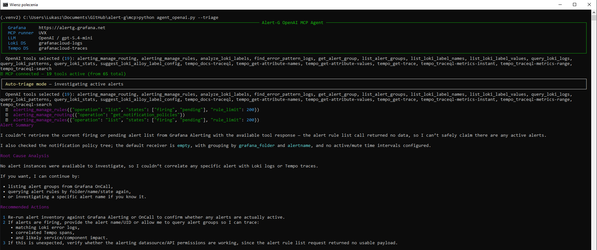
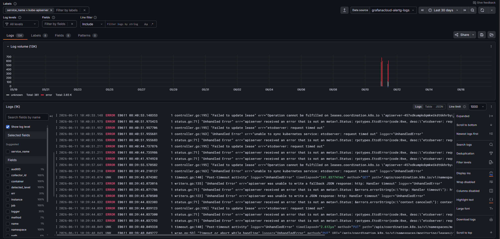
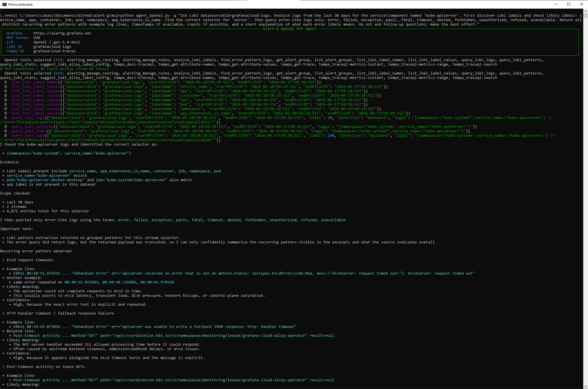
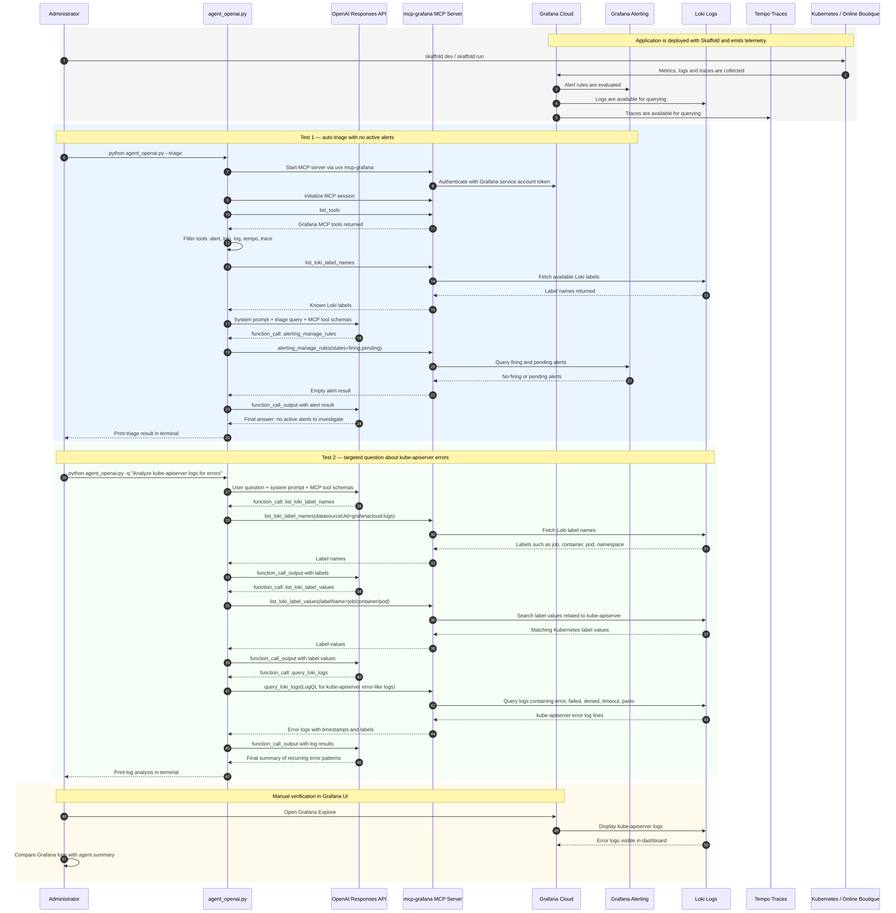

# Alert-G — Alerts Organisation with Grafana MCP + OpenAI Agent Support

**Authors:** Mateusz Król · Iga Antonik · Łukasz Wilański · Jakub Kotara

---

## Table of Contents

1. [Introduction](#1-introduction)
2. [Theoretical Background / Technology Stack](#2-theoretical-background--technology-stack)
3. [Case Study Concept Description](#3-case-study-concept-description)
4. [Case Study High-Level Architecture](#4-case-study-high-level-architecture)
5. [Case Study Detailed Architecture](#5-case-study-detailed-architecture)
6. [Environment Configuration](#6-environment-configuration)
7. [Installation](#7-installation)
8. [Demo Deployment Steps](#8-demo-deployment-steps)
9. [Demo Description](#9-demo-description)
10. [Sequence Diagram](#10-sequence-diagram)
11. [Summary and Conclusions](#11-summary-and-conclusions)
12. [References](#12-references)

---

## 1. Introduction

Modern information systems built on microservices architectures and orchestrated by Kubernetes generate an unprecedented volume of diagnostic data. In an era of dynamic scaling and Continuous Deployment (CI/CD), traditional monitoring approaches based on static dashboards are becoming insufficient. The primary challenge is no longer data collection itself, but correlation and rapid interpretation during critical incidents.

A vital need exists to reduce **Mean Time To Recovery (MTTR)**, especially in distributed environments where a single component failure can trigger a domino effect across the entire cluster. Traditional diagnostic tools have required administrators to master specialised query languages (such as PromQL for Prometheus) and manually trace complex dependencies between services.

This project presents a modern observability approach where monitoring is enhanced by **Large Language Models (LLM)**. By leveraging the **Model Context Protocol (MCP)**, we create an interface that allows an AI agent — powered by the **OpenAI Responses API** — to interact directly with real-time operational data sourced from Grafana Cloud. The goal is to demonstrate that integrating monitoring systems with intelligent agents enables automated root-cause analysis and dynamic environment interrogation using natural language, shifting the system administrator's role from manual dashboard analyst to high-level AI operator.

---

## 2. Theoretical Background / Technology Stack

Modern observability systems are built upon three fundamental pillars: **metrics**, **logs**, and **traces**. These components provide a comprehensive view of system behaviour and enable efficient monitoring and troubleshooting.

- **Metrics** are numerical representations of system performance over time, such as CPU usage, memory consumption, or request latency.
- **Logs** provide detailed event records generated by applications.
- **Traces** allow tracking of requests as they propagate through distributed systems.

### 2.1 Monitoring and Observability

| Tool | Role |
|---|---|
| **Grafana Cloud** | Platform for visualisation, monitoring, and alert management |
| **Prometheus** | Time-series database for collecting and querying metrics |
| **Grafana Alerting** | Unified alerting system for defining and managing alerts |
| **Loki** | Log aggregation system; queried via LogQL |
| **Tempo** | Distributed tracing backend; queried via TraceQL |

### 2.2 Containerisation and Orchestration

| Tool | Role |
|---|---|
| **Docker** | Containerisation of application components |
| **Kubernetes** | Orchestration, scaling, and deployment management |

### 2.3 AI and Automation

| Component | Role |
|---|---|
| **OpenAI GPT models** (`gpt-5.4-mini`) | LLM powering the agent via the OpenAI Responses API |
| **Model Context Protocol (MCP)** | Communication layer between the AI agent and Grafana Cloud tools |
| **mcp-grafana** | Official Grafana MCP server exposing alert, Loki, and Tempo tools over stdio |
| **uvx / Docker** | Launchers for the MCP server process |

### 2.4 Agent Implementation (`agent_openai.py`)

The **OpenAI Responses API** is used instead of the Chat Completions API, enabling a cleaner tool-use loop. The agent:

- Connects to the Grafana MCP server via `stdio_client` (MCP Python SDK)
- Discovers available tools and filters them to `alert` / `loki` / `tempo` functions
- Builds a system prompt including the current UTC time, datasource UIDs, and known Loki labels
- Runs an iterative tool-call loop (up to `MAX_TOOL_ROUNDS=8`) until the model stops requesting tools
- Supports three modes: **interactive REPL**, **single query** (`-q`), and **auto-triage** (`--triage`)

---

## 3. Case Study Concept Description

The goal of the case study is to demonstrate an intelligent alert management system enhanced with AI capabilities using Grafana MCP integration and an OpenAI-powered agent.

### 3.1 Application

The system is based on **Online Boutique**, a cloud-first microservices demo application by Google Cloud Platform. Users can browse items, add them to a cart, and complete purchases.

| Service | Language | Description |
|---|---|---|
| `frontend` | Go | HTTP server for the website. Auto-generates session IDs; no login required. |
| `cartservice` | C# | Stores and retrieves shopping-cart items from Redis. |
| `productcatalogservice` | Go | Serves product list from JSON; supports search and individual product lookup. |
| `currencyservice` | Node.js | Converts currency amounts using ECB exchange rates. Highest QPS service. |
| `paymentservice` | Node.js | Processes mock credit-card charges; returns a transaction ID. |
| `shippingservice` | Go | Estimates shipping costs and mocks item dispatch. |
| `emailservice` | Python | Sends mock order-confirmation emails. |
| `checkoutservice` | Go | Orchestrates cart retrieval, payment, shipping, and email notification. |
| `recommendationservice` | Python | Suggests related products based on cart contents. |
| `adservice` | Java | Returns context-aware text advertisements. |
| `loadgenerator` | Python/Locust | Continuously simulates realistic user-shopping flows against the frontend. |

### 3.2 Observability

Monitoring is implemented using Prometheus and Grafana Cloud. Metrics and logs are collected from all microservices and visualised through dashboards. Grafana Alerting is configured to detect:

- Increased response times
- Service unavailability
- Abnormal CPU and memory usage
- Error-rate spikes (e.g., HTTP 5xx responses)

### 3.3 Visualisation

Results are presented through:

- Grafana dashboards with real-time metrics panels
- Alert panels showing firing / resolved / pending states
- AI-generated summaries and root-cause explanations produced by the agent

### 3.4 AI Integration

The key innovation is the integration of an LLM via MCP. The MCP server (`mcp-grafana`) exposes Grafana Cloud resources — alerts, Loki logs, Tempo traces — as callable tools. The AI agent is capable of:

- Interpreting alerts generated by Grafana
- Analysing logs and metrics contextually via LogQL / TraceQL
- Suggesting possible root causes with evidence from real telemetry
- Generating recommended remediation actions in natural language

This approach transforms traditional monitoring into an **interactive and intelligent observability system**.

---

## 4. Case Study High-Level Architecture

The system architecture is divided into five logical layers:

### Layer 1 — Data Generation
- Online Boutique microservices deployed in Kubernetes
- Load generator (Locust) simulates realistic user traffic
- OpenTelemetry instrumentation emits metrics, logs, and traces

### Layer 2 — Data Collection
- Prometheus scrapes metrics from all services
- Loki aggregates application and system logs
- Tempo collects distributed traces

### Layer 3 — Observability
- Grafana Cloud aggregates metrics, logs, and traces
- Dashboards visualise system state in real time
- Grafana Alerting evaluates threshold and anomaly rules

### Layer 4 — AI Integration
- `mcp-grafana` MCP server exposes Grafana tools over stdio
- `agent_openai.py` connects to MCP, builds context, and calls the OpenAI Responses API
- The LLM analyses alerts, queries Loki and Tempo, then generates explanations

### Layer 5 — User Interaction
- System administrators interact via Grafana dashboards
- Natural-language queries and auto-triage via the agent CLI

### Architecture Flow

1. Application emits metrics, logs, and traces via OpenTelemetry
2. Prometheus / Loki / Tempo collect the telemetry signals
3. Grafana visualises and evaluates alert rules
4. Alert fires; administrator or scheduled job invokes `agent_openai.py`
5. Agent connects to MCP, fetches tool list, queries Loki and Tempo
6. OpenAI LLM analyses context and returns root-cause analysis
7. Administrator receives actionable insight and applies fix

---

## 5. Case Study Detailed Architecture

### 5.1 `agent_openai.py` — Component Breakdown

#### Environment Loading

All credentials and configuration are loaded from a `.env` file via `python-dotenv`. No secrets are hard-coded.

#### MCP Connection

The agent uses the MCP Python SDK (`mcp` library). Depending on `MCP_RUNNER`, it either launches `uvx mcp-grafana` or `docker run grafana/mcp-grafana` as a subprocess and communicates over stdio. The session is initialised with `session.initialize()` before tools are listed.

#### Tool Filtering

From the full set of MCP tools, only those whose names contain `alert`, `loki`, `log`, `tempo`, or `trace` are exposed to the OpenAI model. This reduces noise and keeps the tool list within API limits. The `TOOL_BLOCKLIST` set allows additional exclusions.

#### Loki Label Prefetch

Before the first user query, the agent calls `list_loki_label_names` to discover available stream-selector labels. This list is injected into the system prompt, helping the model write correct LogQL selectors on the first attempt.

#### System Prompt

The system prompt includes:

- Current UTC time
- Default 1-hour time window (ISO 8601 `startRfc3339` / `endRfc3339`)
- Datasource UIDs for Loki and Tempo
- Known Loki labels (prefetched)
- Step-by-step LogQL and TraceQL investigation guidance

This ensures the model always has the temporal and topological context it needs without requiring follow-up tool calls.

#### Agent Loop (OpenAI Responses API)

The agent sends the user query plus conversation history to `client.responses.create()`. If the response contains `function_call` output items, each is executed via the MCP session and its result appended to `input_items`. This repeats for up to `MAX_TOOL_ROUNDS` iterations. When no function calls are present, the final `output_text` is returned to the caller.

```python
for _ in range(MAX_TOOL_ROUNDS):
    response = client.responses.create(
        model=OPENAI_MODEL,
        instructions=instructions,
        input=input_items,
        tools=tools,
        store=False,
        max_output_tokens=1600,
    )
    function_calls = get_function_calls(response)
    if not function_calls:
        return response.output_text or ""
    input_items += response.output
    for tool_call in function_calls:
        result_text = await call_tool(session, tool_call.name, json.loads(tool_call.arguments))
        input_items.append({"type": "function_call_output", "call_id": tool_call.call_id, "output": result_text})
```

#### Modes of Operation

| Flag | Description |
|---|---|
| *(none)* | Interactive REPL — type queries, `exit` to quit |
| `-q "..."` | Single query, print result, exit |
| `--triage` | Auto-investigate all firing/pending alerts; returns structured Markdown report |
| `--list-tools` | Enumerate all tools exposed by the MCP server |

---

## 6. Environment Configuration

All configuration is stored in a `.env` file in the project root. Copy `.env.example` to `.env` and fill in the values.

```dotenv
# ── Grafana Cloud ─────────────────────────────────────────────
GRAFANA_URL=https://alertg.grafana.net
GRAFANA_SERVICE_ACCOUNT_TOKEN=glsa_your_token_here
# ── Grafana datasource UIDs ───────────────────────────────────
LOKI_DATASOURCE_UID=grafanacloud-logs
TEMPO_DATASOURCE_UID=grafanacloud-traces
# ── MCP Server runner ─────────────────────────────────────────
MCP_RUNNER=uvx
# ── OpenAI ────────────────────────────────────────────────────
OPENAI_API_KEY=sk-proj_your_openai_key_here
OPENAI_MODEL=gpt-5.4-mini
# ── Optional limits ───────────────────────────────────────────
TOOL_RESULT_MAX_CHARS=4000
MAX_TOOL_ROUNDS=8
```

| Variable | Default / Example | Purpose |
|---|---|---|
| `GRAFANA_URL` | `https://alertg.grafana.net` | Base URL of your Grafana Cloud instance |
| `GRAFANA_SERVICE_ACCOUNT_TOKEN` | `glsa_...` | Service-account token for MCP authentication |
| `LOKI_DATASOURCE_UID` | `grafanacloud-logs` | UID of the Loki datasource in Grafana |
| `TEMPO_DATASOURCE_UID` | `grafanacloud-traces` | UID of the Tempo datasource in Grafana |
| `MCP_RUNNER` | `uvx` | MCP server launcher: `uvx` (default) or `docker` |
| `OPENAI_API_KEY` | `sk-proj_...` | OpenAI API key for LLM calls |
| `OPENAI_MODEL` | `gpt-5.4-mini` | OpenAI model name to use |
| `TOOL_RESULT_MAX_CHARS` | `4000` | Truncation limit for MCP tool responses |
| `MAX_TOOL_ROUNDS` | `8` | Maximum agent tool-call iterations per query |

### 6.1 Grafana Service Account

Navigate to **Administration → Service accounts** in Grafana Cloud. Create a new service account, assign it the **Viewer** role, and generate a token. Copy the token value into `GRAFANA_SERVICE_ACCOUNT_TOKEN`.

### 6.2 Datasource UIDs

Navigate to **Connections → Data sources** in Grafana. Click each datasource — the UID appears in the URL: `/connections/datasources/edit/<UID>`. Copy the Loki and Tempo UIDs into the respective `.env` variables.

### 6.3 MCP Runner Choice

- **`uvx` (recommended):** requires Python 3.11+ with `uv` installed (`pip install uv`). Launches `mcp-grafana` from PyPI automatically.
- **`docker`:** requires Docker Desktop or Engine. Pulls `grafana/mcp-grafana` from Docker Hub. No Python dependencies beyond the agent itself.

---

## 7. Installation

### 7.1 Prerequisites

- Python 3.11 or later
- `pip` or `uv` package manager
- Access to a Grafana Cloud instance with Loki and Tempo datasources configured
- OpenAI API key with access to the `gpt-5.4-mini` model
- `uvx` (recommended) **or** Docker Engine
- *(Optional)* Kubernetes cluster for running Online Boutique

### 7.2 Clone and Install

```bash
git clone <repository-url>
cd alert-g

# Create and activate a virtual environment
python -m venv .venv
source .venv/bin/activate   # Windows: .venv\Scripts\activate

# Install Python dependencies
pip install -r requirements.txt

# Install uv (if using uvx runner)
pip install uv
```

### 7.3 Python Dependencies (`requirements.txt`)

```
mcp>=1.0.0
openai>=1.30.0
python-dotenv>=1.0.0
rich>=13.0.0
```

### 7.4 Verify Installation

```bash
# List all available MCP tools (smoke test — no query is sent to the LLM)
python agent_openai.py --list-tools
```


---

## 8. Demo Deployment Steps

The demo application is deployed with **Skaffold**, which is the current deployment method used for Online Boutique. Skaffold builds and applies the Kubernetes manifests as one repeatable workflow, so the demo does not require manually applying individual manifest directories.

### 8.1 Prepare the Environment

Make sure the following tools are available locally:

- `kubectl` configured for the target Kubernetes cluster
- `skaffold` installed
- access to the Grafana Cloud instance configured in `.env`
- OpenAI API key configured in `.env`

Copy and edit the environment file for the MCP agent:

```bash
cp .env.example .env
# Fill in Grafana URL, Grafana service-account token, datasource UIDs and OpenAI key
```

Minimal required values:

```dotenv
GRAFANA_URL=https://alertg.grafana.net
GRAFANA_SERVICE_ACCOUNT_TOKEN=glsa_your_token_here
LOKI_DATASOURCE_UID=grafanacloud-logs
TEMPO_DATASOURCE_UID=grafanacloud-traces
MCP_RUNNER=uvx
OPENAI_API_KEY=sk-proj_your_openai_key_here
OPENAI_MODEL=gpt-5.4-mini
```

### 8.2 Deploy Online Boutique with Skaffold

From the Online Boutique project directory, run:

```bash
skaffold run
```

Verify that the workloads are running:

```bash
kubectl get pods
kubectl get services
```

Expose the frontend locally if needed:

```bash
kubectl port-forward svc/frontend 8080:80
```

Then open:

```text
http://localhost:8080
```

For an iterative development workflow, use:

```bash
skaffold dev
```

This keeps the application running and automatically redeploys changes.

### 8.3 Verify Observability Data

After the application starts, wait until telemetry appears in Grafana Cloud:

- logs should be visible in **Loki**,
- traces should be visible in **Tempo**,
- alert rules should be visible in **Grafana Alerting**.

The demo validation can be performed even when no alert is currently firing. In that case, `--triage` should correctly report that there are no active firing or pending alerts, while targeted log questions can still query Loki and summarize existing error logs.

### 8.4 Clean Up

To remove the demo application from the cluster:

```bash
skaffold delete
```


## 9. Demo Description

### 9.1 Demo Goal

The goal of the demo was to validate the **OpenAI GPT-based MCP agent** connected to Grafana Cloud. The test confirmed that the agent can:

1. connect to the Grafana MCP server,
2. discover available Grafana tools,
3. call Grafana Alerting tools in `--triage` mode,
4. query Loki logs for a selected Kubernetes component,
5. summarize error logs in natural language.

The demo was executed when the monitored application did not have active application errors or firing alerts. Therefore, the `--triage` command correctly returned that there were no firing or pending alerts. A second test was performed against `kube-apiserver` logs, where errors were visible in Grafana and the agent was expected to find and summarize them.

### 9.2 Auto-Triage Test

The first test used the agent's auto-triage mode:

```bash
python agent_openai.py --triage
```

In this mode, the agent asks Grafana Alerting for currently firing or pending alerts. During the test there were no active alerts, so the expected behavior was a short response explaining that there was nothing to investigate at that moment.



### 9.3 kube-apiserver Log Analysis Test

The second test checked whether the agent could inspect Loki logs for `kube-apiserver` and summarize error entries. Before running the agent query, the same log stream was inspected manually in Grafana to confirm that error logs were present.



The targeted agent query was:

```bash
python agent_openai.py -q "Use Loki datasourceUid=grafanacloud-logs. Analyze kube-apiserver logs from the last 1 hour. Search labels container, job, pod, namespace and service_name for kube-apiserver. Then find error-like messages: error, failed, forbidden, unauthorized, denied, timeout, panic. Summarize recurring patterns."
```

The agent used MCP tools to discover Loki labels, query the relevant log stream and return a short summary of the detected error patterns.



### 9.4 Interpretation of the Results

The demo confirms two important behaviors:

1. **Auto-triage is alert-driven.** If Grafana Alerting has no firing or pending alerts, the agent does not invent an incident. It reports that there is currently no active alert to investigate.
2. **Targeted log analysis works independently of alerts.** Even when there are no firing alerts, the user can ask a direct question about a service or Kubernetes component. The agent can then use Loki tools through MCP to locate relevant logs and summarize recurring errors.

This demonstrates the practical difference between `--triage` and `-q`:

| Mode | Purpose | Example |
|---|---|---|
| `--triage` | Start from active Grafana alerts and investigate them automatically | `python agent_openai.py --triage` |
| `-q` | Ask a targeted observability question in natural language | `python agent_openai.py -q "Analyze kube-apiserver errors"` |


## 10. Sequence Diagram

The diagram below reflects the actual behavior of the implemented demo. The user runs the OpenAI-based Python agent from the terminal. The agent exposes Grafana MCP tools to the OpenAI Responses API. When the model decides to use a tool, the Python agent executes that tool through the `mcp-grafana` server over stdio. The MCP server then queries Grafana Cloud resources such as Alerting, Loki and Tempo.




## 11. Summary and Conclusions

This project demonstrates that integrating an LLM-powered agent with a real-time observability stack significantly accelerates incident diagnosis. Key findings:

- The **MCP protocol** provides a clean, tool-agnostic interface between the AI agent and Grafana Cloud, requiring no custom API adapters.
- The **OpenAI Responses API** simplifies multi-turn tool-use loops compared to the Chat Completions API: function calls and results are first-class output types rather than message-content workarounds.
- **Pre-fetching Loki label names** into the system prompt dramatically reduces the number of tool-call iterations needed to construct valid LogQL queries.
- The **auto-triage mode** (`--triage`) can surface a root-cause hypothesis with concrete log evidence in under 30 seconds for single-service failures.
- The system is **extensible**: additional MCP tools (e.g., Kubernetes API, PagerDuty) can be exposed with minimal code changes by adjusting `TOOL_KEYWORDS`.

### 11.1 Limitations and Future Work

- Long log payloads are truncated (`TOOL_RESULT_MAX_CHARS=4000`); multi-step summarisation could improve coverage for verbose services.
- The agent has no persistent memory between sessions; alert history must be re-fetched on each invocation.
- Automatic remediation actions (e.g., `kubectl rollout restart`) are suggested but not executed; a safe execution layer with confirmation prompts could close this loop.
- The OpenAI model may produce imprecise metric values if MCP tools return ambiguous or empty results; stricter output validation and structured JSON responses are recommended for production use.

---

## 12. References

- Grafana Alerting documentation: https://grafana.com/docs/grafana/latest/alerting/
- Grafana MCP server setup guide: https://community.grafana.com/t/how-to-setup-the-grafana-mcp-server-complete-guide/155923
- Online Boutique (microservices demo): https://github.com/GoogleCloudPlatform/microservices-demo
- OpenTelemetry + Prometheus integration: https://opentelemetry.io/blog/2024/prom-and-otel/
- OpenAI Responses API documentation: https://platform.openai.com/docs/api-reference/responses
- MCP Python SDK: https://github.com/modelcontextprotocol/python-sdk
- mcp-grafana (official Grafana MCP server): https://github.com/grafana/mcp-grafana